# RC Planes
A multi year exploration into building radio controlled planes, with at least 20 unique planes designed, fabricated, built, and tested.  

Applicable Skills:
- Onshape, Surface modeling
- Fusion 360 CAM
- Designing for manufacturability 
- 3d Printing
- CNC Router Machining
- Proactive Research
- Iterative design
- Soldering

PICUTRE OF PLANES:

****

  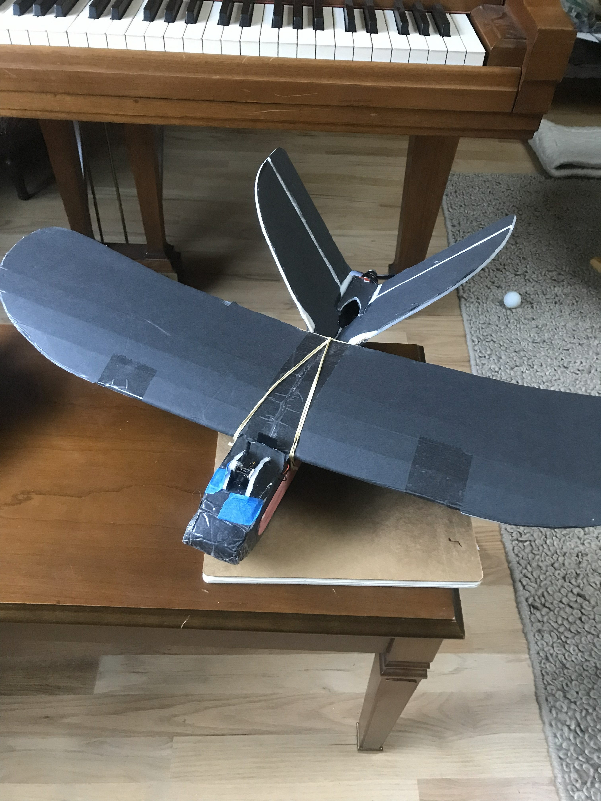
  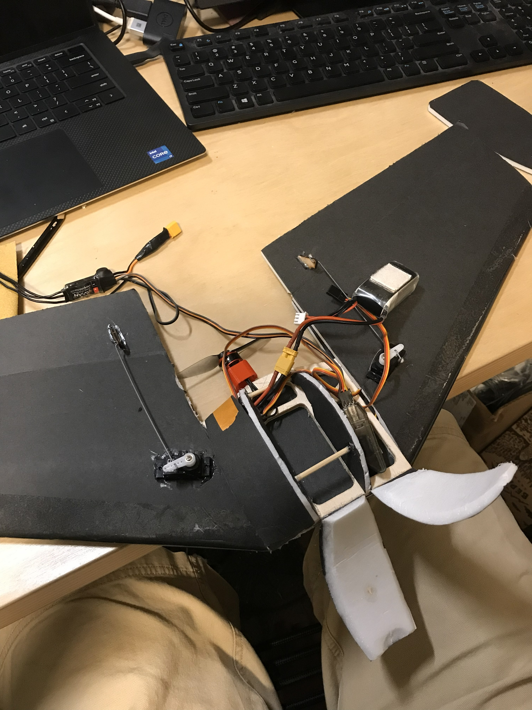
  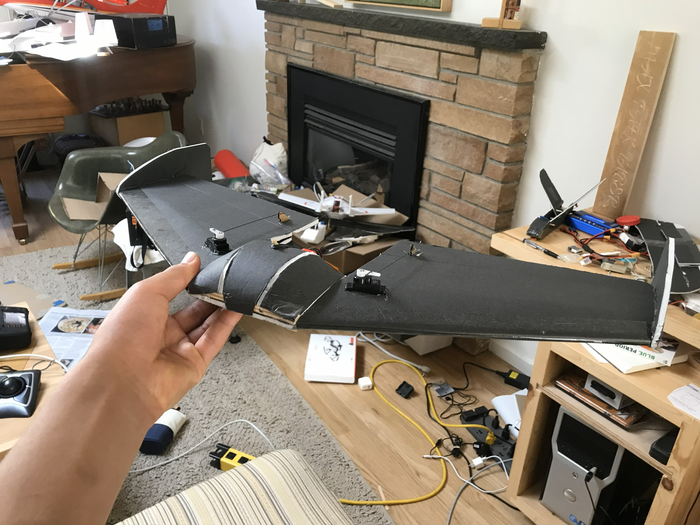
  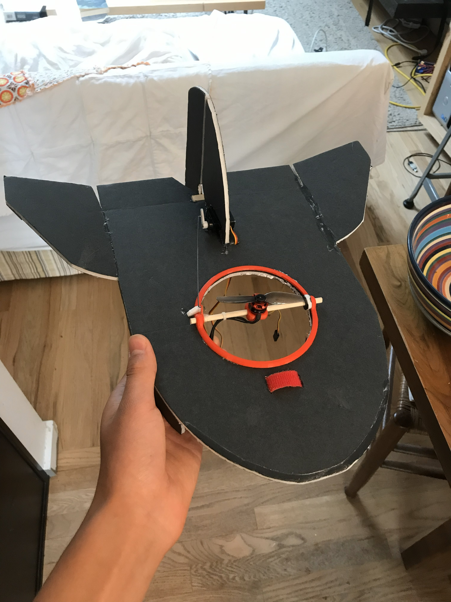
  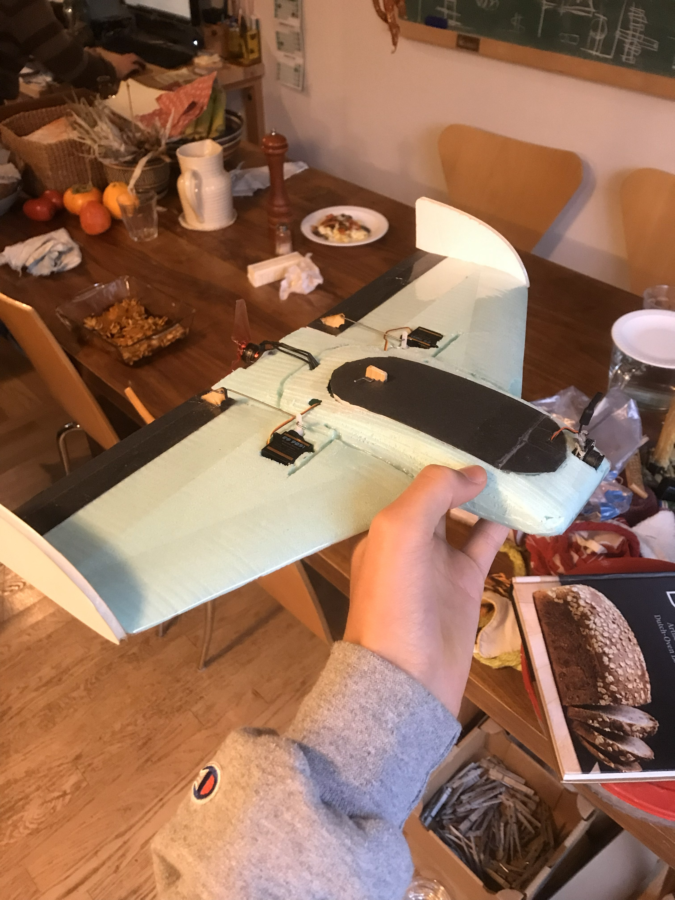
  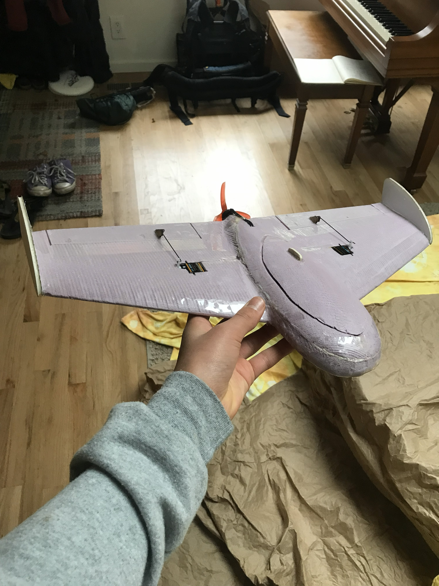
  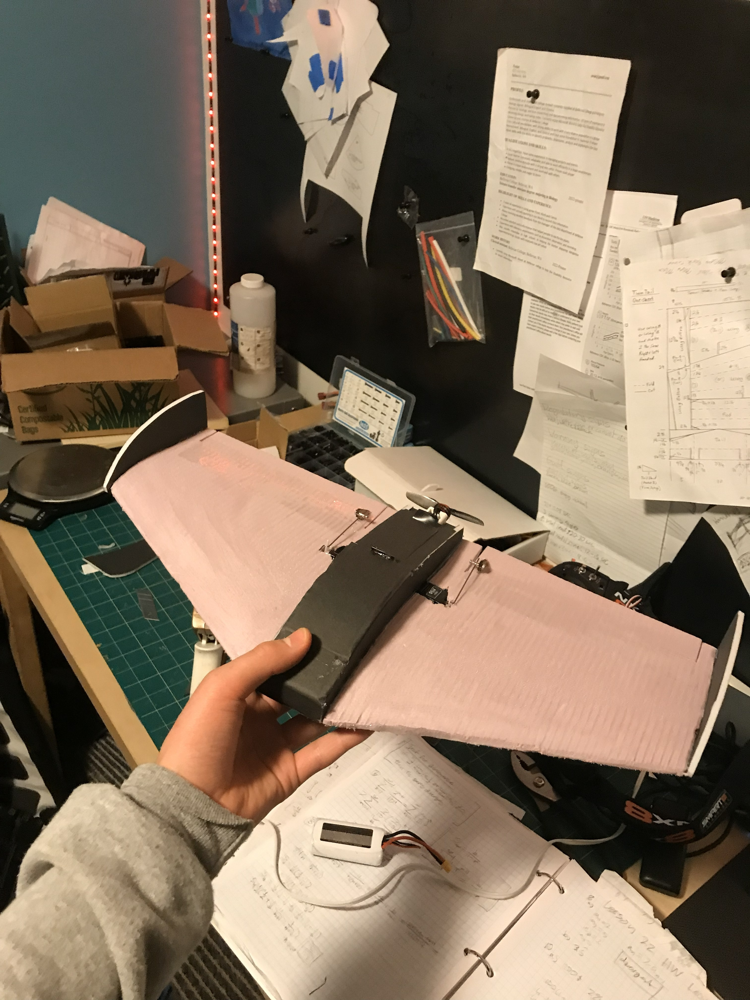
  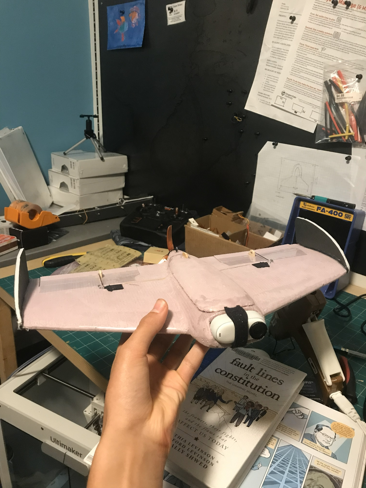
  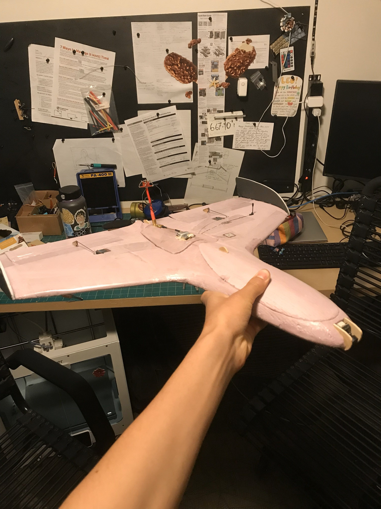

****
As shown above, I have made planes from a variety of martials and various construction methods. The part that I would like to share about, however, is when I began using CAD, CAM, and flight controllers in my planes, as I believe that prosses is the most relevant to the work I hope to do as an engineer. 

They all followed a similar prosses, however, so we will use the following 250g flying wing as an example.

## CAD and Design
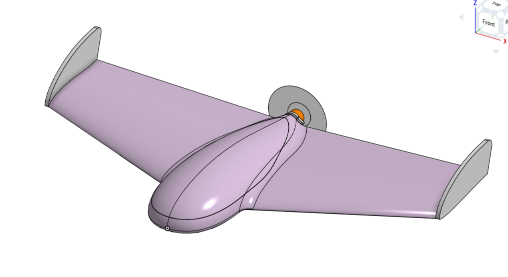

The CAD side of this RC plane project primarily served as a sandbox for exploring surface modeling in the context of aerodynamics. I used surface modeling techniques to incorporate elements into my CAD designs such as reflexed airfoils, smooth fuselages, and hatches, while keeping center of gravity and manufacturability in mind. In many cases, a single aircraft went through multiple iterations before being manufactured.

## CAM and Fabrication
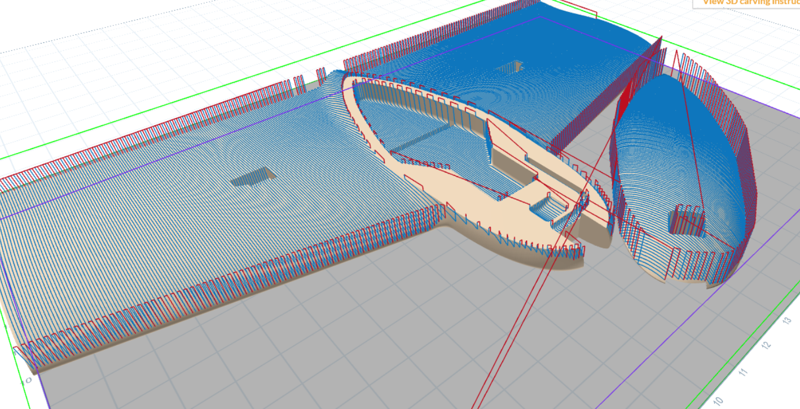

I used both Easel CNC and, later, Autodesk Fusion 360’s manufacturing workspace to machine the aircraft bodies out of XPS insulation foam. Because both the top and bottom surfaces needed to be machined, indexing pins and corresponding holes in the stock were used to accurately locate and align operations on each side.

## Installing Electronics

  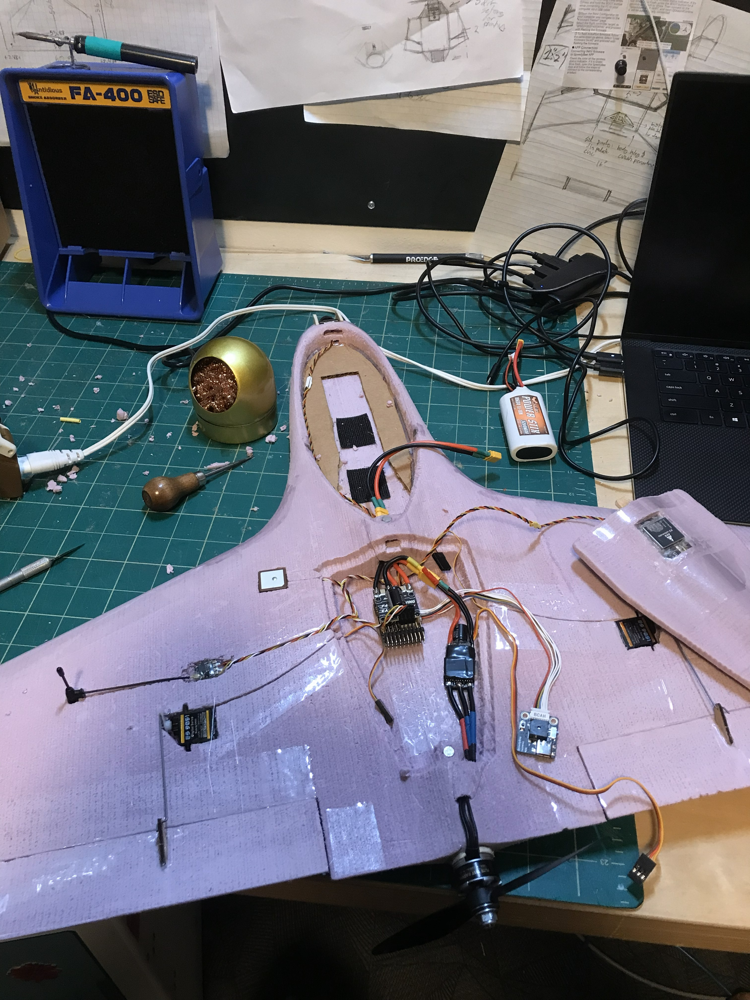
  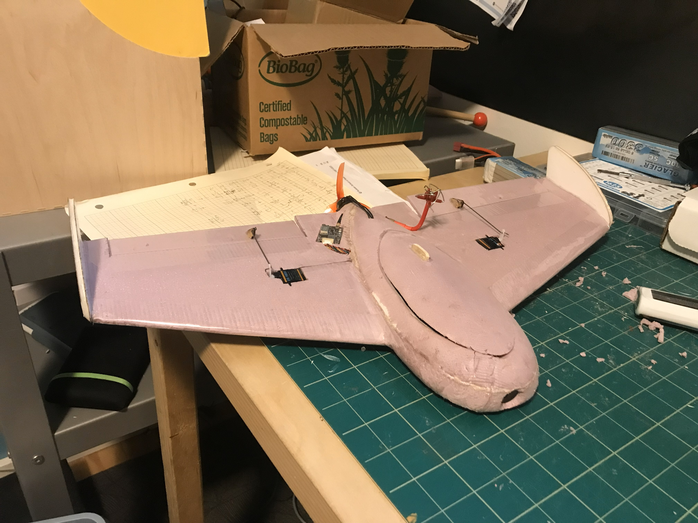

This aircraft was equipped with a SpeedyBee F405 Wing Mini flight controller running iNav, along with an analog FPV system and ExpressLRS for RC control. Working with this software required a significant amount of self-teaching, and through this process I also learned how to solder.

The plane was fitted with an FPV (first-person view) video system, consisting of an onboard camera and transmitter, allowing me to fly using FPV goggles from the aircraft’s point of view.

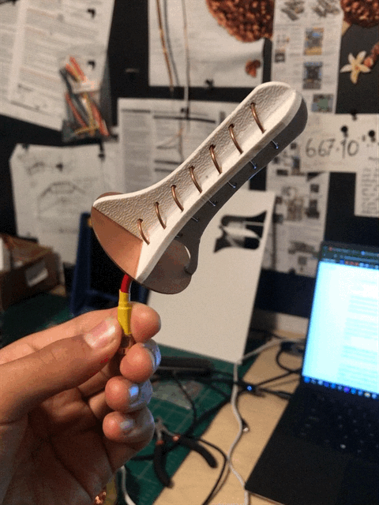

Interested in increasing the range of my video system, I experimented with building helical antennas with varying numbers of turns to improve antenna gain. The image shown is a seven-turn helical antenna, which increased my usable range from approximately 2 miles to 3.5 miles. While I did not fully understand the underlying math or theory behind how helical antennas increase gain, this experimentation was one of the most satisfying parts of the project.

Here is a short video of some video footage of the plane if you are interested in viewing: 

[Video of plane flying and footage from the POV of the plane: https://youtu.be/CbH9q1GkPZs](https://youtu.be/CbH9q1GkPZs)

## Current Interests: 3D Printing Planes

I played around with 3d printing designs. To reduce weight and maximize strength in places I need it, I am designing each part to be printed with single walls and internal ribbing.

The plane will be printed from lightweight PLA which is a foaming printing filament. It is incredibly stringy however. To prevent this, each layer is designed to be printed in one uninterrupted line, which is a significant challenge, yet a fun problem to solve.  

